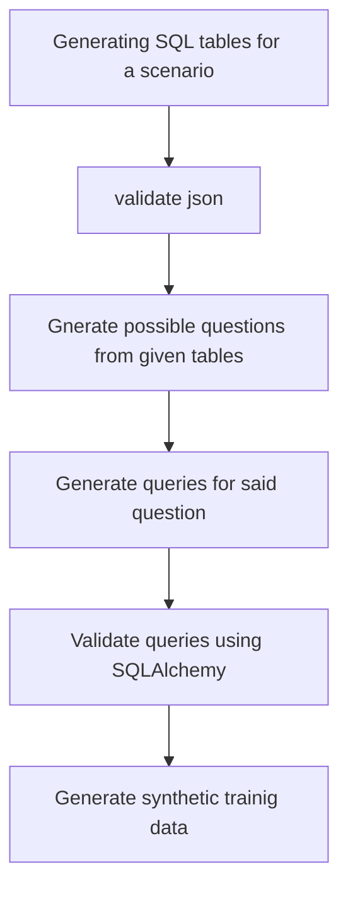

** This project is a pipeline to generate high quality synthetic dataset (from larger LLM eg. LLAMA 3 70b) to be used for training smaller models for performing NQL (Natural Query Language) tasks **

# Overview


# Requirements
```shell
pip install "unsloth[colab-new] @ git+https://github.com/unslothai/unsloth.git" <br>
pip install --no-deps "xformers<0.0.27" "trl<0.9.0" peft accelerate bitsandbytes  ratelimit <br>
pip install torch transformers datasets rich <br>
pip install pandas sqlalchemy <br>
```
# Instructions
```shell
export PYTHONPATH="${PYTHONPATH}:/mnt/a/WorkBench/datasci"

```
